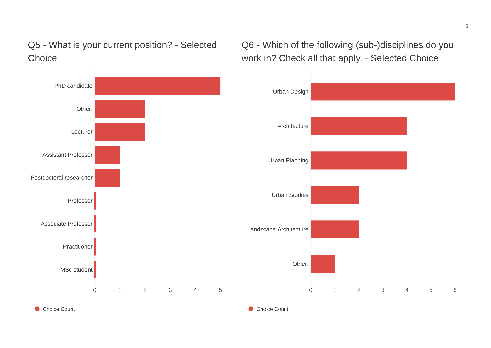
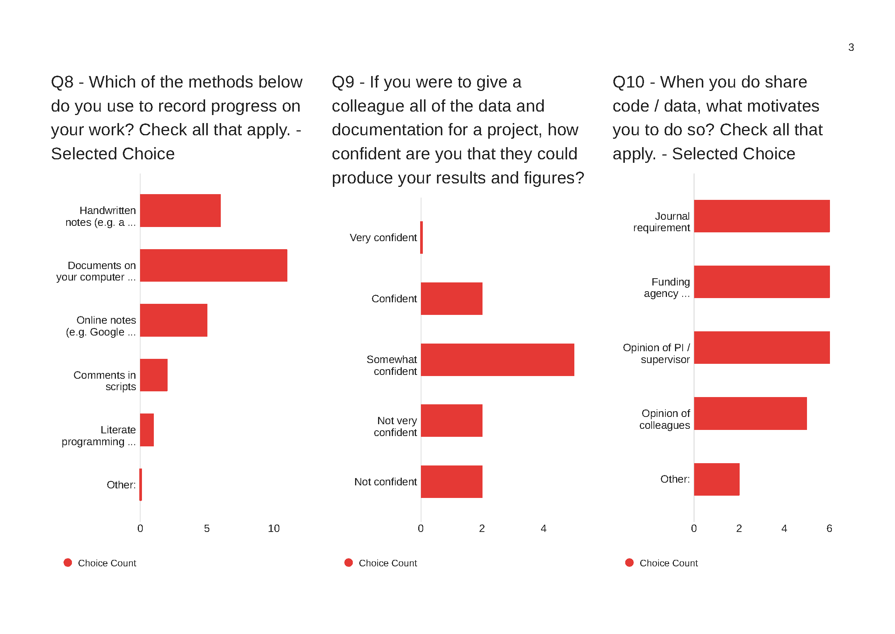
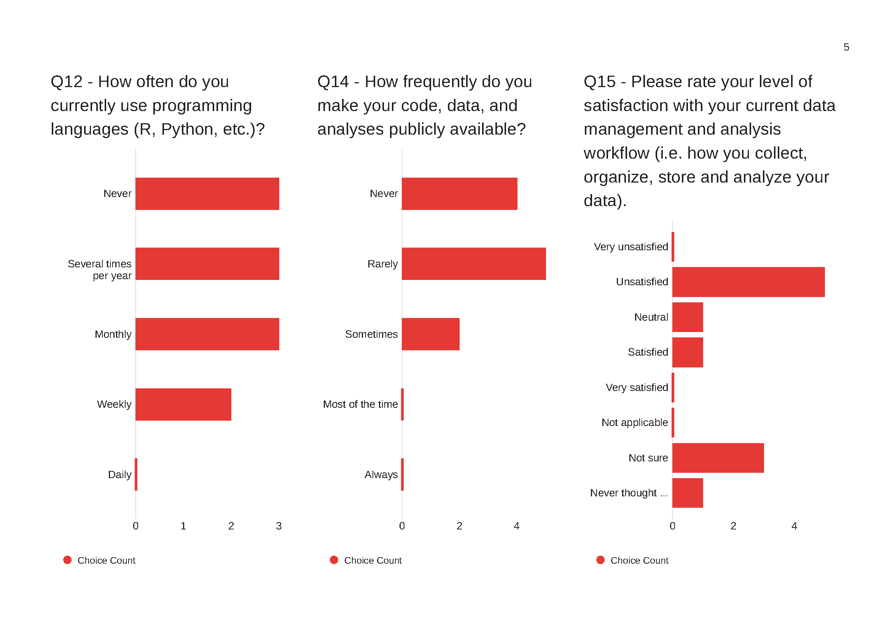
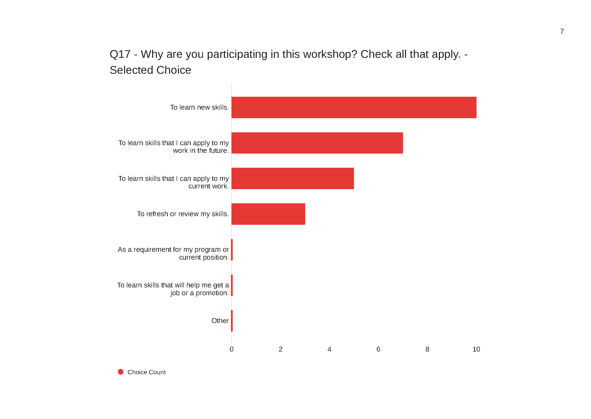
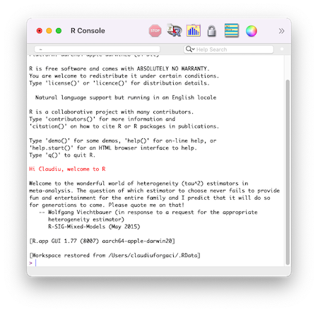

# Welcome

# Overview

## Rbanism

> - **Organised as part of [Rbanism](https://www.esciencecenter.nl/claudiu-forgaci/)**, a Netherlands eScience Center fellowship project.

> - **Rbanism aims to build capacity, competence, and confidence** for working with data and research software in the urbanism research community at large.

> - **This workshop is the first of an event series** focusing on reproducibility, automation and scalability in urbanism research.

> - **Promote the practice of reproducibility and automation** necessary for accelerating scientific progress in urbanism and associated fields.


## Workshop schedule

-   **Introduction** (9:30)
-   **Organisation**
    -   *Coffee break*
-   **Automation I**
    -   *Lunch break* (12:30-13:30)
-   **Automation II**
-   **Literate programming I**
    -   *Coffee break*
-   **Literate programming II**
-   **Publishing**
    -   *Wrap-up & drinks* (16:30)


## Introduction

-   Getting to know you
-   Recognize the problems that reproducible research helps address
-   Introduce tools that address your pain points in making your research reproducible
-   **Demo**: Computational toolkit for reproducible data analysis


## Getting to know you...

<center>
{width=75%}
</center>


## ...with respect to reproducibility

<center>
{width=75%}
</center>


## ...with respect to reproducibility

<center>
{width=75%}
</center>


## ...with respect to reproducibility

<center>
{width=75%}
</center>


# Why should we care about reproducibility?

## Motivating reproducibility

“Computational notebooks [...] open up the world of analytics to [...] disciplines that encompass diverse methodologies and skillsets [such as] urban planning [...] Some urban planners focus on policymaking [...] Others employ qualitative methods to work in and with vulnerable communities. Others develop simulation models to forecast urbanization patterns and infrastructure needs. Others intermingle these, and many more, different approaches to understanding and shaping the city. Yet **all urban planners benefit [or should!] from basic quantitative literacy and an ability to reason critically with data**. This scholarly and professional imperative aligns with **the growing importance of computational thinking in the urban context** and parallel trends in geocomputation [...], geographic data science [...], and the open-source/open-science movements [...].” ([Boeing, 2019, p. 40](https://doi.org/10.18335/region.v6i3.278))


## Motivating reproducibility

“**toolkits relying on point-and-click interfaces are inefficient in the era of big data.** 
Due to the limited scope for automation of tasks, not only is workflow efficiency 
reduced but also the reproducibility of the underlying research is compromised, 
because this largely depends on the (often undocumented) sequence of decisions 
manually operating the software. [...] We then argue that **the field [of urban morphology] 
needs a shift from dominant traditional geographic information system (GIS) environments 
based on a graphical user interface (GUI; e.g., QGIS or ArcMap) towards reproducible
open code-based workflows.**” ([Fleischmann et al., 2022, p. 3](https://onlinelibrary.wiley.com/doi/10.1111/gean.12302))


## Motivating reproducibility

> - Even qualitative work like literature reviews can be done in a systematic, reproducible and automated way (e.g., see 
[Krishnan et al., 2021](https://link.springer.com/chapter/10.1007/978-3-030-76059-5_24))
> - A reproducible workflow allows for close scrutiny and interaction with the data and results of a publication, potentially
leading to new insights as well (e.g., see [Cottineau, 2022](https://link.springer.com/article/10.1007/s11192-021-04256-8))
> - Reproducibility can contribute to increasing the scientific legitimacy of design-focused urbanism research 
often regarded as pseudoscientific (see [Marshall, 2012](https://link.springer.com/article/10.1057/udi.2012.22))


## However, these are potentials yet to meet

> - Everyone (urbanists and non-urbanists) struggles with reproducibility and it is a hindrance to moving science forward
> - Even with a fairly simple analysis challenges are usually faced in four main areas: organization, automation, documentation, and dissemination


## Four facets of reproducibility

1.  **Organization:** tools to organize your projects so that you don't have a single folder with hundreds of files

2.  **Automation:** the power of scripting to create automated data analyses

3.  **Documentation:** difference between binary files (e.g. docx) and text files and why text files are preferred for documentation

4.  **Dissemination:** publishing is not the end of your analysis, rather it is a way station towards your future research and the future research of others


# Reproduciblility toolkit

## R + RStudio

<div class="columns-2">

<br><br><br><br>

</div>


## Why R?

<div class="columns-2">

<div>
<br>

- Made for data analysis
- Free!
- Open source
- Widely used across disciplines
- Runs on Windows, OS X, or Linux
</div>

<div>

</div>

</div>


## Once in R

<div class="columns-2">

<div>
<br>
You could just type into the console...

- ... but that doesn't help much with documentation

- ... but that doesn't help much with automation
</div>

<div>
{width=100%}
</div>

</div>
## A better solution

<div class="columns-2">
With RStudio you can combine your programming and your documentation

- RStudio gives you a single environment to combine your documentation and your
analysis
- It runs on top of R
- Gives you a bunch of really cool features some of which we'll explore throughout the
workshop

<div>
{width=100%}
</div>


## Anatomy of RStudio

<div class="columns-2">
- Upper left: Editor
- Lower left: Console
    - Text on top at launch: version of R that you’re running
    - Below that is the prompt
- Upper right: Workspace and command history
- Lower right: Plots, access to files, help, packages, data viewer

<div>
{width=100%}
</div>

</div>


## R Packages

- Packages are the fundamental units of reproducible R code. They include reusable R
functions, the documentation that describes how to use them, and (often) sample data.
(From: http://r-pkgs.had.co.nz)

- We will use the `ggplot2` package for plots and `dplyr` for data wrangling in this
session.

- If you have not yet done so, install these packages by running the following
in the Console:
```{r eval=FALSE}
install.packages("ggplot2")
install.packages("dplyr")
```

- This is just one way of installing a package, there is also a GUI approach in
the Packages pane


# Demo

## Goals of the demo

- Demonstrate "good practice" for organizing data files and analysis
documents (R Markdown)
- How to read data from a file
- How to manipulate the data, and document it in a reproducible way
- How easy it would be to revert any changes if need be
- How to subset data
- How to make simple plots

**NOT** about understanding all the R commands, but **rather** getting the big
picture of how using R in this way facilitates reproducible analyses


## Preparation

1. Download the archive you received by email with the files we will use in the workshop. 

2. Follow the instructions in the email to unzip the archive into a folder that you will use as your project folder. 

3. Put a green sticky note on the front of your laptop if you are ready or a pink one if you need help and a helper will approach you.


## R Markdown demo

- Go to your project folder and double click on `documents/intro-demo.Rmd` and it should open in RStudio

- Click on *Knit HTML* to compile the document

- Read the output and discuss why this way of documenting research is reproducible


## Take aways

- The analysis is self-documenting
- It's easy to extend or refine analyses by copying and modifying code blocks
- The results of the analysis can be disseminated by sending R Markdown and
providing data sources, or just simply providing the generated HTML if just
a summary of the analysis is needed


# Reproducibility checklist

## Reproducibility checklist

Checklist available in `documents/checklist.md`

- Serves as a tool to help you think about the reproducibility of your data
analysis.
- Many of the questions can be thought of as having a yes/no answer.
- A better approach would be to see the questions as being open ended with
the real question being, "What can I do to improve the status of my project
on this bullet point?"
- With that in mind, you'll never get 100% of the bullets right for your project,
but you'll always be improving.
